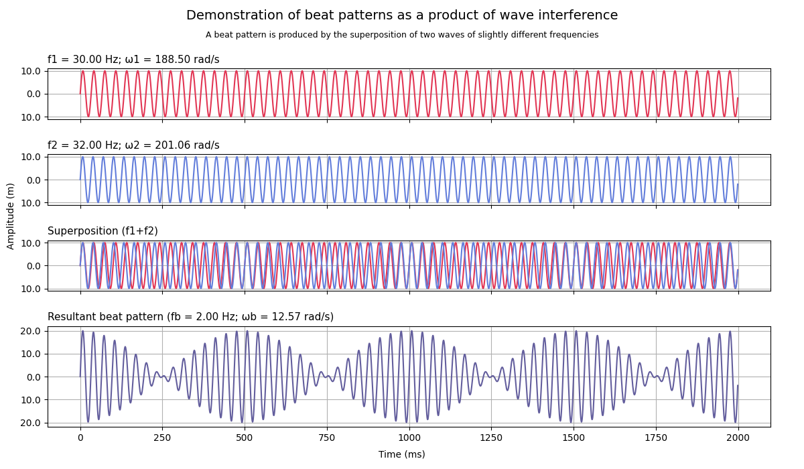
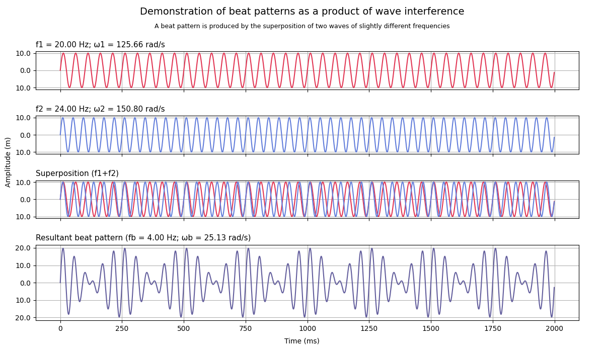
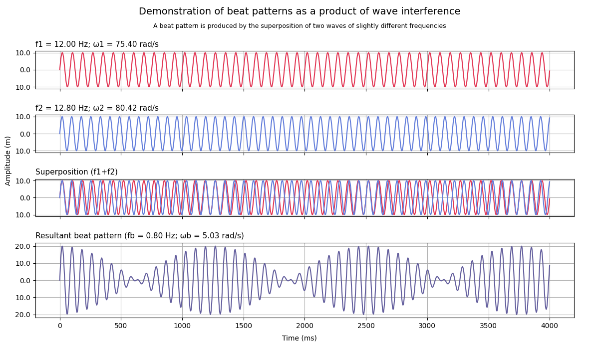
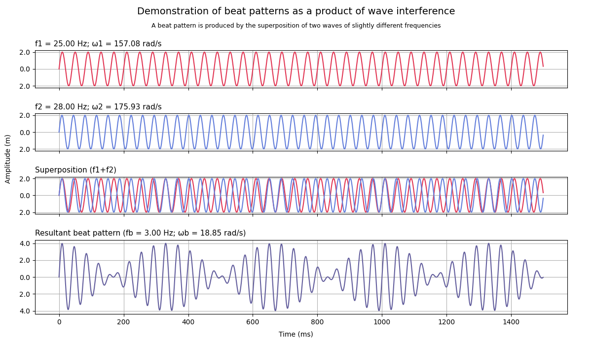

# Wave beats
Modeling and visualization of wave interference and beat 
patterns in Python

* Python 3.9.0
* NumPy 1.22.0
* Matplotlib 3.5.1

---

A beat is an interference pattern between two sounds of slightly different 
frequencies at the same point in space, perceived as a periodic variation 
in volume whose rate is the difference of the two frequencies

<br/>
<p align="center">
  
</p>

## Execution
#### Display help:

```
$ python beat_pattern.py -h   
usage: beat_pattern.py [-h] [-w1] [-w2] [-a] [-t]   

Plot the superposition of two waves by definition 
of frequencies, amplitude and time

optional arguments:
  -h, --help        show this help message and exit
  -w1, --wave1      wave 1 frequency (Hz) (default: 30)
  -w2, --wave2      wave 2 frequency (Hz) (default: 32)
  -a, --amplitude   waves amplitude (m) (default: 10)
  -t, --time        points to evaluate function (s) (default: 2)
```
---
### Example 1
#### Input args:
    $ python beat_pattern.py

| Flag |     Argument     |    Value     | Unit |
|:----:|:----------------:|:------------:|:----:|
|      | Wave 1 frequency | 30 (default) |  Hz  |
|      | Wave 2 frequency | 32 (default) |  Hz  |
|      |    Amplitude     | 10 (default) |  m   |
|      |       Time       | 2 (default)  |  s   |

#### Output:


---
### Example 2
#### Input args:
    $ python beat_pattern.py -w1 20 -w2 24

| Flag |     Argument     |    Value     | Unit |
|:----:|:----------------:|:------------:|:----:|
| -w1  | Wave 1 frequency |      20      |  Hz  |
| -w2  | Wave 2 frequency |      24      |  Hz  |
|      |    Amplitude     | 10 (default) |  m   |
|      |       Time       | 2 (default)  |  s   |

#### Output:


---
### Example 3
#### Input args:
    $ python beat_pattern.py -w1 12 -w2 12.8 -t 4

| Flag |     Argument     |    Value     | Unit |
|:----:|:----------------:|:------------:|:----:|
| -w1  | Wave 1 frequency |      12      |  Hz  |
| -w2  | Wave 2 frequency |     12.8     |  Hz  |
|      |    Amplitude     | 10 (default) |  m   |
|  -t  |       Time       |      4       |  s   |

#### Output:


---
### Example 4
#### Input args:
    $ python beat_pattern.py -w1 25 -w2 28 -a 2 -t 1.5

| Flag |     Argument     | Value | Unit |
|:----:|:----------------:|:-----:|:----:|
| -w1  | Wave 1 frequency |  25   |  Hz  |
| -w2  | Wave 2 frequency |  28   |  Hz  |
|  -a  |    Amplitude     |   2   |  m   |
|  -t  |       Time       |  1.5  |  s   |

#### Output:

